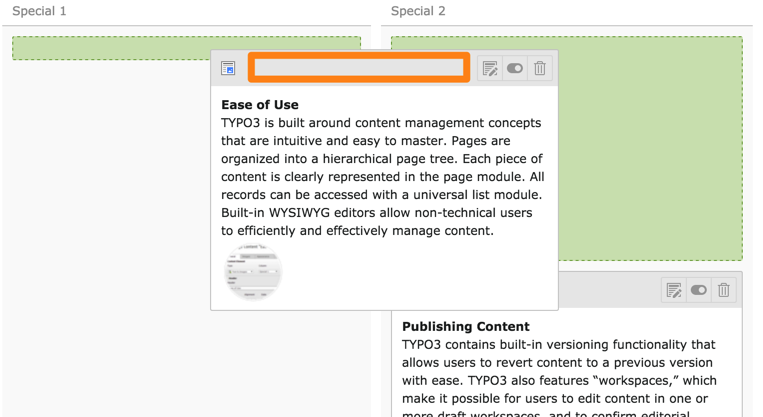


.. include:: ../../Includes.txt

.. _content-working:

Travailler avec du contenu
^^^^^^^^^^^^^^^^^^^^^^^^^^

Le travail du contenu se passe essentiellement dans le module **WEB > Page**.
Nous allons commencer par faire un tour du module, qui est assez riche.

Le module *Page* dispose de trois fonctions ou modes différents :
"Édition rapide", "Colonnes" et "Langues". La première vous déplace
directement à la modification du premier élément de contenu sur la page.
Cela peut être un peu perturbant au début et n'est pas recommandé.
Le mode "Langues" sera abordé plus tard quand on parle de traductions.

Pour l'instant, nous voulons être en mode "Colonnes".
Si tel n'est pas le cas lorsque vous vous déplacez vers le module *Page*,
veuillez utiliser le menu d'action haut pour changer de mode.

.. figure:: ../../Images/PageModuleFunctions.png
   :alt: Changement de mode dans le module Page

La capture d'écran ci-dessous montre à quoi ressemble la page d'accueil du
paquet d'introduction dans le backend TYPO3 CMS. Le contenu est réparti
entre les différents zones de contenu ( "Haut", "Milieu: Gauche", "Milieu: Center", etc.)
appelées **colonnes**.

De nombreuses icônes sont grisées pour obtenir une interface moins chargée.
Certaines icônes n'apparaissent pas du tout jusqu'à ce que
l'on survol des zones spécifiques.

.. figure:: ../../Images/PageModuleColumns.png
   :alt: Une vue typique du module Page avec plusieurs colonnes de contenu

Que peut-on voir sur cette vue?

#. Cette icône apparaît uniquement lorsque vous survolez le titre de la colonne.
   Elle est utilisée pour modifier tous les éléments de contenu de cette colonne.

#. Ajoute un nouvel élément de contenu à cette colonne précisément cette position.

#. Cette icône représente le type de l'élément de contenu.
   Dans le cas présent, c'est un élément de contenu personnalisé représenté
   par l'icône par défaut, mais elle peut varier et fournir un indice visuel
   sur le type du contenu.

#. Ces icônes s'allument lorsque l'on survol l'élément entier.
   Elles sont utilisées pour - respectivement - modifier un élément de contenu,
   l'activer / le désactiver ou le supprimer.

Vous pouvez cliquer partout sur la zone en surbrillance
d'un élément de contenu pour le modifier.

.. _content-working-moving:

Déplacement des éléments de contenu
^^^^^^^^^^^^^^^^^^^^^^^^^^^^^^^^^^^

Les éléments de contenu peuvent être déplacés simplement
en utilisant le glisser/déposer.

Cliquez dans la barre grise en haut d'un élément de contenu pour commencer à le glisser.
Le module *Page* vous montrera alors où vous pouvez le déposer.

Déplacer un élément de contenu d'une page à une autre est plus compliquée,
car vous devez utiliser le module *Liste* pour effectuer une opération de couper et coller.
Référez-vous au :ref:`tutoriel de Mise en route <t3start:clipboard>`
pour l'utilisation du module de liste.
