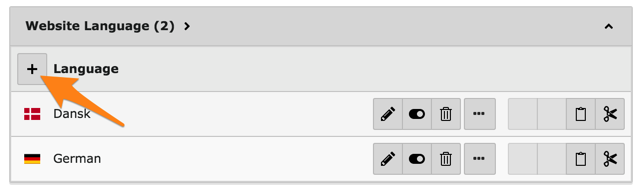
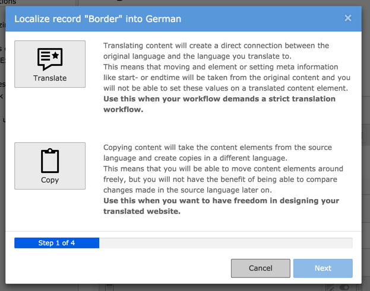


.. include:: ../Includes.txt

.. _languages:

Travailler avec les langues
---------------------------

TYPO3 CMS est livré avec la capacité native de gérer
les sites web en plusieurs langues.

.. _languages-new:

Définition d'une nouvelle langue
^^^^^^^^^^^^^^^^^^^^^^^^^^^^^^^^

La langue par défaut n'est jamais définie explicitement.
Ce sera celle que vous choisirez comme telle.
Les autres langues doivent d'abord être créées dans le backend
pour ensuite être utilisées en vue de traduire les pages
et les éléments de contenu.

La langue par défaut du paquet d'introduction est l'anglais
et les langues danoise et allemande sont déjà définies.
L'ajout d'une nouvelle langue est aussi simple que la création
d'un nouvel enregistrement, mais elle ne peut se faire que
sur la page racine.

Utilisez le module **WEB > Liste** et placez-vous sur la page
"New TYPO3 Site". Déscendez un peu, jusqu'à ce que vous voyez
la liste des « Langue du site web ».

Cliquez sur l'icône "Créer un nouvel enregistrement"
et définissez votre nouvelle langue.

.. figure:: ../Images/LanguagesNewLanguage.png
   :alt: Mise en place d'une nouvelle langue

Donnez à votre nouvelle langue un titre,
choisissez une langue officielle dans la liste déroulante
et choisissez un drapeau. Enregistrer et fermer, vous avez terminé.

.. _languages-translations:

Travailler avec les traductions
^^^^^^^^^^^^^^^^^^^^^^^^^^^^^^^

Allez au module **WEB > Pages** et sur la page d'accueil "Félicitations".
En utilisant le menu d'action haut, passez à la vue "Langues".

.. figure:: ../Images/LanguagesPageLanguages.png
   :alt: La vue "Langues" du module Page

Utilisez le menu intitulé "Créer une nouvelle traduction de cette page"
pour créer une nouvelle traduction. Choisissez la langue dans le menu déroulant,
disons allemande dans ce cas. Un formulaire de saisie va s'affichier
pour la traduction de la page (ce qu'on appelle "Langue alternative de la page"):

.. figure:: ../Images/LanguagesNewPageTranslation.png
   :alt: Création d'une nouvelle traduction de la page

Il suffit d'entrer la traduction dans le champ "Titre de la page"
et enregistrer les modifications. De retour dans le module *Page*,
nous pouvons maintenant voir la langue par défaut et la version allemand
côte à côte.

.. figure:: ../Images/LanguagesPageVersions.png
   :alt: Affichage des langues côte à côte dans le module de page

Le module de *Page* permet de copier facilement des éléments contenus
dans la nouvelle langue en appuyant sur le bouton "Traduire".
Faites-le maintenant la zone de contenu "Bordure",
vous devriez voir ce qui suit:

Les traductions peuvent être soit reliées entre elles
soit sans rapport. Comme l'explique l'assistant le mode strict
doit être utilisé lorsque tous les contenus dans la langue par défaut
sont destinés à être traduit de telle sorte que chaque traduction
est strictement liée à un élément dans la langue par défaut.
Le mode "copie" créera également une copie, mais la copie ne
sera pas liée avec sa source d'origine.
C'est le mode à privilégier lorsque les traductions
du site web divergeront de la langue par défaut.

Pour cet exemple, cliquez sur la grande icône "Traduire",
puis sur le bouton "Suivant". L'étape 2 de l'Assistant se déroulera
automatiquement puisque nous traduisons dans une seule langue.
L'étape 3 fournit un résumé des éléments qui seront traduits.
Appuyez sur le bouton « Lancer le traitement » pour commencer.
Vous devriez voir le résultat suivant:

.. figure:: ../Images/LanguagesNewContentTranslation.png
   :alt: Une traduction nouvellement créée d'élément de contenu

Vous pouvez observer que le contenu du nouvel élément
a été préfixé avec *[Traduction de l'allemand:]*.
Notez également qu'il est caché par défaut, de sorte que
les traductions incomplètes n'apparaissent pas sur le site Web.

.. figure:: ../Images/LanguagesTranslatedContentElement.png
   :alt: Un élément de contenu traduit, avec référence à son origine

Vous pouvez voir que le nouvel élément de contenu est lié
à celui de la langue par défaut (dans le champ "Traduction originale").
Dans la plupart des champs se strouve également une indication du contenu de la langue par défaut.

Le module *Page* peut désormais sembler encombré,
avec une colonne par traduction existante. Il est possible d'afficher
une seule langue à la fois et avec la mise en page originale,
en basculant au mode "Colonnes" et en choisissant une langue
spécifique dans le menu d'action haut.

.. figure:: ../Images/LanguagesColumnModeWithTranslation.png
   :alt: Le mode "colonne" affichant une traduction

