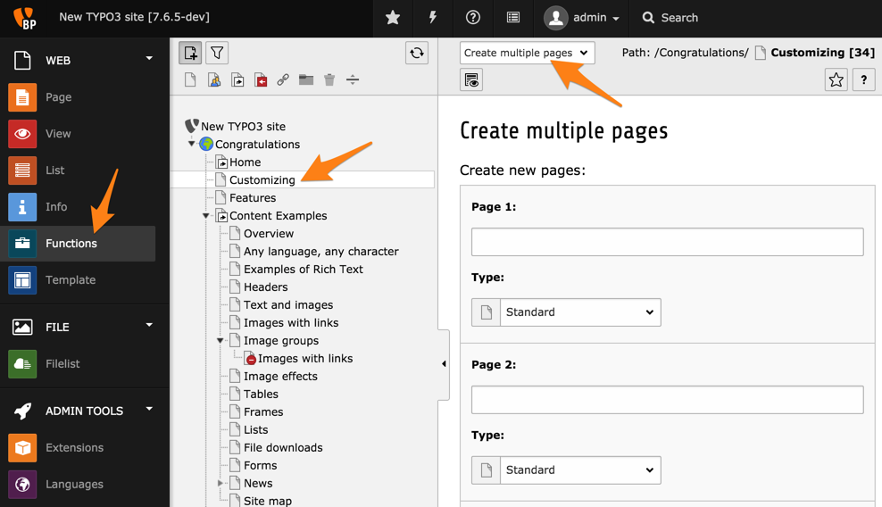


.. include:: ../../Includes.txt

.. _pages-multiple:

Ajout de plusieurs pages à la fois
^^^^^^^^^^^^^^^^^^^^^^^^^^^^^^^^^^

Vous pouvez créer plus d'une page à la fois en utilisant
le module **WEB > Fonctions**.

Placez vous sur la page qui devra être la page mère
des nouvelles pages.

Sélectionnez l'assistant **Créer plusieurs pages multiples**.

Pour chaque page, vous pouvez définir son titre et choisir son type.

Au bas de l'assistant se trouvent plusieurs options :

.. figure:: ../../Images/FunctionsCreateWizardBottom.png
   :alt: Options diponibles au bas de l'assistant de création de multiples nouvelles pages

En cochant la case **Placer les nouvelles pages à la suite**,
les nouvelles pages seront ajoutées en dessous des sous-pages existant actuellement.
Sinon, elles seront placées au-dessus des sous-pages actuelles.

Vous pouvez choisir d'ajouter plus de pages que proposées
(5 par défaut) en cliquant sur le bouton "Ajouter plus de lignes".

Les options **Masquer les nouvelles pages** et
**Masquer les nouvelles pages dans les menus** vous permettent
de gérer la visibilité de vos nouvelles pages.

.. tip::

   Une page cachée ne peut pas être consultée par qui que ce soit via le site web.
   Une page qui est cachée dans les menus ne figure pas dans la navigation du site,
   mais peut être consultée par une personne ayant l'URL directe de cette page.

Une fois que vous avez terminé cliquez sur le bouton **Créer les pages**.
