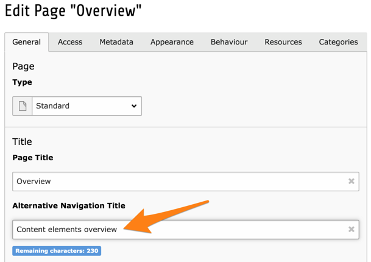
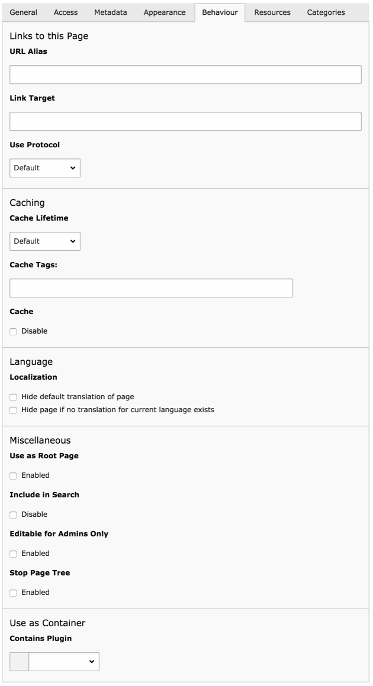

.. include:: ../../Includes.txt

.. _pages-properties:

Propriétés de la page
^^^^^^^^^^^^^^^^^^^^^

Les pages dans TYPO3 CMS ont de nombreuses propriétés.
Jusqu'à présent, nous avons vu le titre (ce qui est tout à fait évident),
la case à cocher "Visibilité > Page > Désactiver" qui cache la page
dans le frontend et la case à cocher "Visibilité > Dans les menus > cacher"
qui fait en sorte que la page n'apparaîsse pas dans les éléments de navigation
quels qu'ils soient.

.. _pages-properties-titles:

Les titres, la navigation et les URL
""""""""""""""""""""""""""""""""""""

Tout d'abord, il est intéressant de noter comment les titres de page,
les URL et les éléments de navigation sont liés.

.. figure:: ../../Images/PagePropertiesTitle.png
   :alt: Impact du titre de page sur l'URL, la navigation et les métadonnées

Le titre de la page est utilisé directement pour générer des URL parlantes.
Il est également utilisé dans les menus et dans la balise `<title>`.

Dans les propriétés de la page, un titre de navigation peut également être défini.

Voyons l'impact que cela a sur le site web :

.. figure:: ../../Images/PagePropertiesNavigationTitle.png
   :alt: Impact d'un titre de navigation différent

Le menu utilise maintenant le titre de navigation. Tous les autres cas
d'utilisation du titre de pages ne sont pas modifiés.

.. note::

   On pourrait dire que le fil d'Ariane est également un élément
   de navigation et devrait donc être également affecté par ce changement.
   C'est vrai, mais chaque menu peut être configuré séparément dans
   TYPO3 CMS et peut donc avoir un comportement qui lui est propre.

Nous allons sauter l'onglet *Accèss*, car les propriétés liées à l'accès
et à la visibilité sont discutées ailleurs, et passer aux autres onglets.

.. _pages-properties-metadata:

Métadonnées
"""""""""""

Un grand nombre de métadonnées peut être saisie dans l'onglet *Métadonnées*.
C'est évident, mais il convient de mentionner que l'utilisation réelle
de ces métadonnées dans le frontend dépend de la façon dont le site est configuré.

Le paquet d'introduction fait usage des champs "description",
"mots clés" et "auteur" pour remplir les balises meta correspondantes.
La description est utilisée à nouveau pour définir la balise meta `og:description`,
alors que le titre de la page est utilisé pour la balise meta `og:title`.

Tout cela est géré en TypoScript rendant TYPO3 CMS puissant et flexible.

.. _pages-properties-appearance:

Apparence
"""""""""

Comme on peut s'y attendre l'onglet *Apparence* contient des propriétés
qui vont influencer la façon dont la page est affichée dans le frontend.

.. figure:: ../../Images/PagePropertiesAppearance.png
   :alt: L'onglet "Apparence" des propriétés de la page

La mises en page Backend détermine combien de zones de contenu
sont mises à disposition pour la saisie dans le module **WEB > Page**.
Mais elle peut également être utilisée comme information
pour influencer le rendu réel de l'interface frontend.

Un champ intéressant est "Montrer le contenu de cette page" en bas de l'écran.
Il indique à la page d'afficher le contenu d'une autre page sélectionnée.
Pour répéter le contenu d'une seule page, cela est beaucoup plus facile
à utiliser que les :ref:`points de montage <pages-types>`.

.. _pages-properties-behaviour:

Comportement
""""""""""""

L'onglet *Comportement* a un riche ensemble d'options et
influence des aspects très différents de la page.

La première partie est liée aux liens. Elle définit si un alias
peut être utilisé pour un lien vers cette page.
Ce n'est pas lié aux URL parlantes.
Si vous définissez "foo" comme alias, on peut appeler la page
à l'aide de `http://www.votre-site.example.org/index.php?id=foo`.
Une cible par défaut pour appeler cette page peut également être définie,
ainsi qu'un protocole spécifique.

La partie "Mise en cache" vous permet de définir une durée de cache
spécifique pour cette page ou de désactiver complètement le cache
pour cette page (chose que vous devriez éviter).
Toutes les pages qui ont la même étiquette de cache auront
leur cache supprimé lorsque le cache est vidé en utilisant cette balise.
Notez toutefois que cela n'est pas utilisé par TYPO3 CMS par défaut,
mais peut être utilisé par des extensions.

La partie "Langue" remplace le comportement par défaut des traductions.
Ceci est couvert de manière plus approfondie dans le
:ref:`Guide de localisation Frontend <t3l10n:start>`.

Viennent ensuite plusieurs cases à cocher avec des significations différentes :

Utiliser comme page racine
  Indique que cette page est le début d'un nouveau site web.
  L'icône de page est remplacée par une icône du monde,
  comme on le voit pour la page "Félicitations".

Inclure dans la recherche
  Par défaut, chaque page sera incluse dans le moteur de recherche
  intégré à TYPO3 CMS (extension "indexed_search"). Utilisez cette
  option pour exclure la page en cours.

Editable seulement par des administrateurs
  Cela restreint l'édition de la page strictement aux utilisateurs
  avec des droits d'administrateur, peu importe ce que les autres
  autorisations ont pu autoriser.

Fin de l'arborescence
  Influences seulement le backend et arrête le rendu des
  pages filles de cette page dans l'arborescence des pages.

Enfin, la propriété "Utiliser comme conteneur" est juste une indication
de ce que la page peut contenir, mais ne restreint pas les types
d'enregistrement qui peuvent être créés. Elle va changer l'icône de la page
et est juste une aide visuelle.

.. _pages-properties-resources:

Ressources
""""""""""

La première partie de l'onglet *Ressources* permet de lier des fichiers
multimédia à la page courante. Ce qui est fait avec ces liens dépend
de la configuration de rendu frontend. Typiquement, cela peut être utilisé
pour associer une image à chaque page, mais il n'y a pas de comportement
préconfiguré.

.. figure:: ../../Images/PagePropertiesResources.png
   :alt: L'onglet "Ressources" des propriétés de la page

Les propriétés restantes sont liées à la :ref:`page TSconfig <t3tsconfig:pagetsconfig>`.
Ceci est un langage de configuration qui peut être
utilisé pour paramétrer de nombreuses parties du backend.

.. _pages-properties-categories:

Catégories
""""""""""

TYPO3 CMS fournit un outil de catégorisation global.
Par défaut les catégories peuvent être appliquées à des pages,
des éléments de contenu, et des fichiers.

.. figure:: ../../Images/PagePropertiesCategories.png
   :alt: L'onglet "Catégories" des propriétés de la page

Les catégories doivent être définies dans certains dossier et
peuvent ensuite être affectées à des pages.
Le :ref:`type d'élément de contenu <content-special>`
"Menus spéciaux" peut afficher - entre autres -
une liste de pages d'une catégorie sélectionnée.
