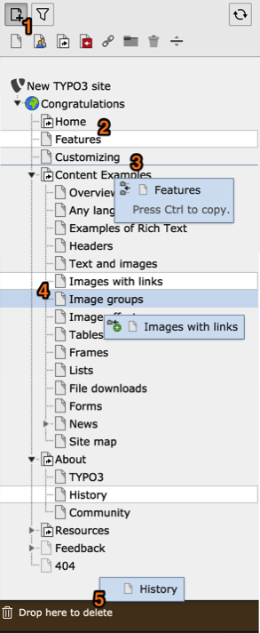

.. include:: ../../Includes.txt

.. _pages-working-with:

Working with Pages
^^^^^^^^^^^^^^^^^^

You have already seen the page tree, this chapter shows how easily pages are
created, moved around, hidden and deleted. Most can be achieved by
dragging and droppping.

.. _pages-drag-drop:

Drag and Drop
"""""""""""""

#. Click on the "new page" icon to display icons corresponding to the various
   page types. Drag and drop any of these icons in your page tree to create
   a new page of that type.

#. To move an existing page, grab the page title (not the icon!) and drop it anywhere
   in the page tree.

#. The page tree shows the point where the page will be inserted once
   you drop it. A bubble help displays information about possible
   actions options (i.e. copy instead of move)

#. This page is being copied. Note the page highlighted with the light blue
   background. If the page is dropped now, it will become of child of that
   page.

#. When you move a page to the bottom of the screen, a "delete" zone appears.
   Drop the page there to delete it. There is no confirmation dialog box,
   but the "delete" zone offers to undo the operation for a little while.

.. note::

   A lot can also be achieved using the context menu, as is explained
   in the :ref:`Getting Started Tutorial <t3start:the-context-menu>`.