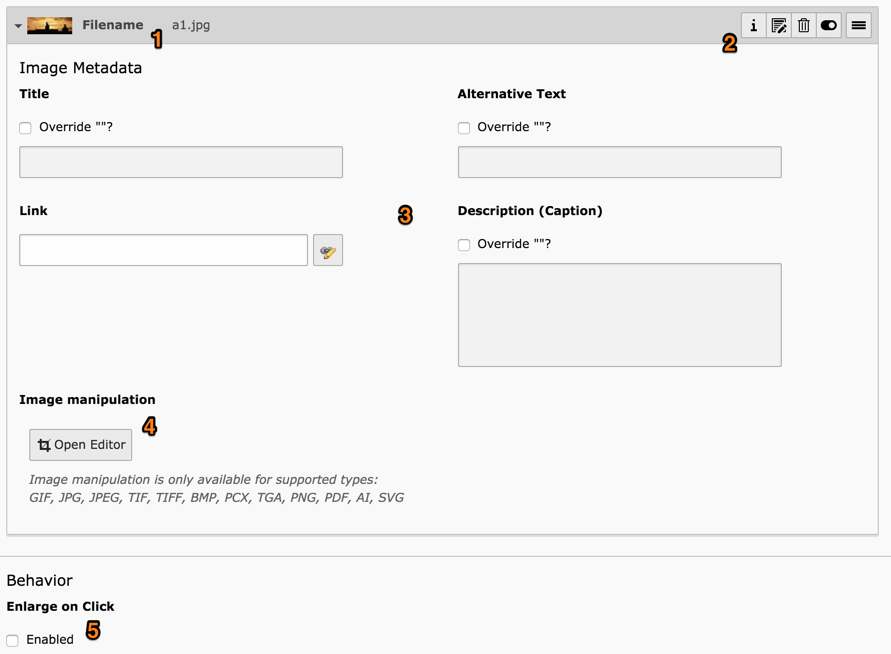

.. include:: ../../Includes.txt

.. _images:

Travailler avec des images
^^^^^^^^^^^^^^^^^^^^^^^^^^

Étant donné que nous travaillons avec un élément de contenu
"Text & Images", nous allons lui ajouter des images !

Allez sur l'onglet "Images".

.. figure:: ../../Images/EditContentAddImage.png
   :alt: Ajout d'une image à l'élément de contenu

Cliquer sur le bouton "Ajouter une image" va ouvrir
une fenêtre pour sélectionner une image.

.. figure:: ../../Images/ImageSelector.png
   :alt: La fenêtre de sélection des images

Naviguer dans l'arborescence de fichiers pour atteindre
le dossier :file:`exemples`. Cliquer dessus va déclencher
l'affichage des fichiers qu'il contient dans la partie droite
de la fenêtre. Vous pouvez cocher la case "Afficher les miniatures"
pour obtenir un aperçu de chaque image.

Vous avez deux façons de sélectionner une image.
Cliquer sur son nom permet de sélectionner l'image et fermer la fenêtre.
Cliquer sur l'icône "+" ne va que sélectionner l'image,
ce qui permet de sélectionner plusieurs images avant de fermer la fenêtre.

Une fois que vous êtes de retour dans votre élément de contenu,
vous pouvez effectuer un certain nombre d'actions ou paramétrer l'image plus loin.

Tout d'abord quelques informations à propose de l'image sont affichées (1) :
la vignette et le nom du fichier.
La flèche à côté de la vignette est utilisée pour réduire
l'affichage des détails de l'image.

Une série d'icônes (2) vous permet d'agir sur l'image
ou sur sa relation à l'élément de contenu :

- L'icône "Modifier" vous permet d'éditer les métadonnées de l'image choisie.
  Méfiez-vous, car cela pourrait avoir un impact
  aux autres endroits où l'image est utilisée.

- L'icône "Supprimer" supprime l'image de l'élément de contenu,
  mais ne supprime pas l'image elle-même.

- L'icône "Cacher l'enregistrement" permet d'afficher ou cacher l'image.

- L'icône "Déplacer" (à droite) est utilisée par glisser-déposer pour modifier l'ordre des images

La zone centrale (3) vous permet d'éditer les métadonnées de l'image
en ce qui concerne sa relation actuelle à l'élément de contenu.
Si vous cochez les cases correspondantes "Surcharger ?",
vous pouvez définir un titre spécifique, texte alternatif et la légende
pour la relation de cette image à l'élément de contenu en cours.

Vous pouvez expérimenter avec l'éditeur d'image (4),
qui vous permettra de recadrer l'image.

Enfin, si vous cochez la case "Agrandissement au clic" (5),
l'image sera liée au fichier original qui ser affiché dans la visionneuse.

.. _images-appearance:

Apparence de l'image
""""""""""""""""""""

Déplacez vous sur l'onglet "Apparence" de l'élément de contenu,
vous pouvez définir d'autres comportements pour les images
attachées à l'élément de contenu.

.. figure:: ../../Images/EditContentAppearance.png
   :alt: Modification de l'apparence des images

Dans "Réglages de l'image" vous pouvez choisir d'appliquer
une bordure ou un effet spécial aux images. Vous pouvez
également choisir une qualité spécifique pour ces images.

Dans "Alignement de l'image" vous pouvez choisir où les images
doivent être positionnées par rapport au texte. Les images sont
automatiquement disposées en colonnes, deux par deux.
Vous pouvez modifier ce comportement avec le champ "Nombre de colonnes".

.. _images-new:

Nouvelles images
""""""""""""""""

De nouvelles images peuvent être ajoutées à l'aide des boutons
de téléchargement présents dans la fenêtre de sélection d'image
ou en utilisant le module **FICHIER > Fichiers**.

L'utilisation du module *Fichiers* est couverte dans le
:ref:`tutoriel de mise en route <t3start:the-file-module-or-image-archives>`.
